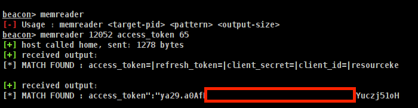

# MemReader BoF

MemReader Beacon Object File will allow you to search and extract specific strings from a target process memory and return found bytes to the beacon output.

* I Want to give a shout out to [osok](https://github.com/osok) for helping create this

* `git clone https://github.com/trainr3kt/MemReader_BoF.git`
* `cd MemReader_BoF`
* `make`
* `load aggressor script`

